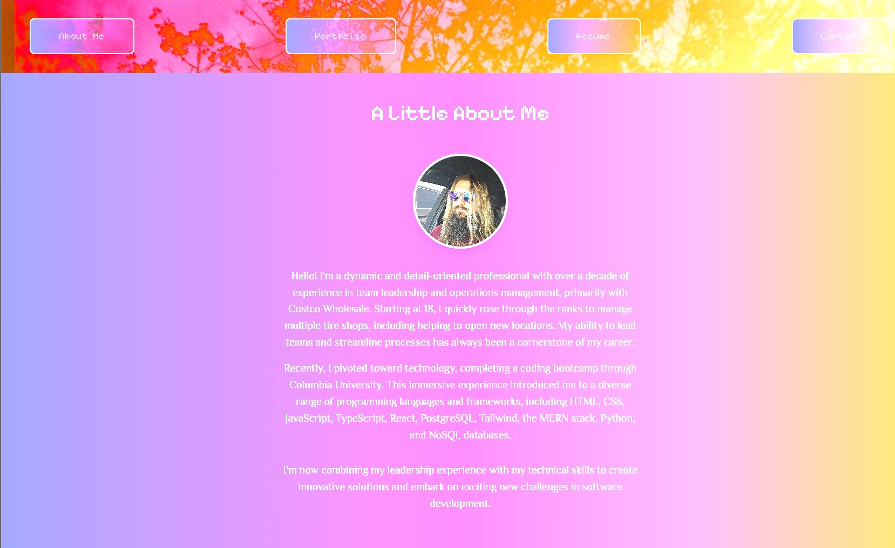

# Tim Ehli's React Portfolio

Welcome to my React Portfolio! This single-page application showcases my skills in building modern, responsive web applications using the latest React technologies. Explore my work, learn about my background, and get in touch through the contact form.

## Table of Contents

- [Overview](#overview)
- [User Story](#user-story)
- [Features](#features)
- [Technologies](#technologies)
- [Screenshots](#screenshots)
- [Links](#links)
- [License](#license)

## Overview

This portfolio application was built using React and modern web development practices. It includes multiple sections that highlight my professional experience, portfolio projects, and contact information—all without needing to reload the page. With mobile-first design, custom styling, and intuitive navigation, this project demonstrates my ability to build polished, single-page applications.

## User Story

**AS** an employer looking for candidates with experience building single-page applications  
**I WANT** to view a potential employee's deployed React portfolio of work samples  
**SO THAT** I can assess whether they're a good candidate for an open position

## Features

- **Responsive Design:** Mobile-first approach for a seamless experience on any device.
- **Single-Page Application:** Navigation between About Me, Portfolio, Resume, and Contact sections using React Router without page reloads.
- **Header & Navigation:** Persistent header with a navigation bar that highlights the active section.
- **About Me Section:** Contains a recent photo/avatar and a short bio about my professional background.
- **Portfolio Section:** Showcases six of my projects, each with an image, title, and links to the live application and corresponding GitHub repository.
- **Resume Section:** Provides a button to request/view my resume along with a list of my proficiencies.
- **Contact Section:** Features a contact form with input validation for required fields and a proper email format.
- **Footer:** Includes icon links to my LinkedIn and GitHub profiles.
- **Modern Styling:** Custom color palette and animations for an engaging user interface.

## Technologies

- **React:** Front-end library for building the user interface.
- **React Router:** For smooth navigation between sections.
- **Tailwind CSS:** Utility-first CSS framework for styling.
- **Vite:** For fast development and build process.
- **React Icons:** For including scalable vector icons (e.g., LinkedIn and GitHub icons).
- **@react-pdf-viewer/core:** For displaying the resume PDF within the application.

## Screenshot

## Links

- Linkdin: https://www.linkedin.com/in/tim-ehli-6a0752176//
- GitHub: https://github.com/Saosyn

## License

This project is licensed under the MIT License.
